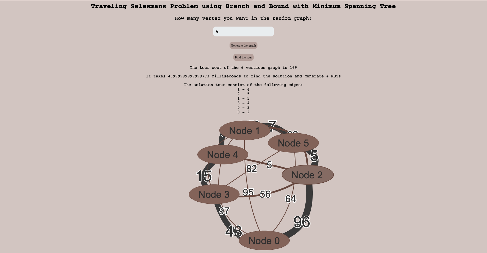

# Traveling-Salesman-Problem
Solving and visualizing the Traveling Salesman Problem using Branch and Bound algorithm with Minimum Spanning Tree 


## **The Branch and Bound Algorithm with Minimum Spanning Tree for TSP**

The branch and bound algorithm is based on the principle that we cut off the subset of the solution, e.g: feasible suboptimal solution, that is, the total set of feasible solutions is partitioned into smaller subset of solution. 
The total number of possible solutions is reduced by the branching process, and the smaller subsets can then be evaluated systematically until the best solution is found. 
At the heart of this bottom-up method, we'll see one of the things we keep track of is the bound. We'll keep track of what a lower bound is or, in other words, the best solution could possibly be. And the bound guarantees that we can solve each sub-problem and find the global optimal. Generally speaking, the branching strategy and the bound calculation of the node can be obtained in any way. Here, we will use the Minimum Spanning Tree algorithm to yield an undirected path that connects all the vertices together at the lowest cost and calculate the cost of the tour as lower bound, and the vertex with the highest degree is the one we branch on in the next step. 


In summary, the branch and bound algorithm stepwise enumerates all the possible candidate solutions by exploring the search space by the means of a decision tree.
In each node, we will branch and constraint to achieve the sub-problem in the next level, and we will calculate the bound of the following splitted node to see if the feasible solution is better than the solution we found so far to decide whether to update the best solution. 

The notation of the algorithm is as followed:

 * $G = (V,E)$ the input undirected graph of TSP.
 * $c : E  \rightarrow  R$ is the weight of the edge should be non-negative.
 * $P \subseteq E$ the path P is the set of edge E.
 * $MST()$ is the minimum spannign tree algorithm, and the $MST(E')$ refer to the algorithm in the subgraph $G(V,E')$
 * $C^\*$ the best tour ever found.

Our goal is to find a tour that visits all vertices once, the algorithm is described in algorithm 2. While the pseudo code stated below is formulated as an iterative scheme, in our
implementation it’s implemented with recursion to simplify variables in the scope.

##
Algorithm MST Branch and Bound for TSP


&nbsp; $C^\* := undefined$<br/>
&nbsp; $S:={E}$<br/>
&nbsp; **while** $S \neq \emptyset$ **then**<br/>
&nbsp; &nbsp; &nbsp; Take top $E' \in S$<br/>
&nbsp; &nbsp; &nbsp; **if** $G(V,E')$ is disconnected **then**<br/>
&nbsp; &nbsp; &nbsp; &nbsp; &nbsp; **continue** {Prune by infeasibility}<br/>
&nbsp; &nbsp; &nbsp; **end if**<br/>
&nbsp; &nbsp; &nbsp; Compute $M:=MST(E')**<br/>
&nbsp; &nbsp; &nbsp; **if** $M$ is a spanning path **then**<br/>
&nbsp; &nbsp; &nbsp; &nbsp; &nbsp; Let $T$ be the tour by joining the end points of the path $M$<br/>
&nbsp; &nbsp; &nbsp; &nbsp; &nbsp; **if** $C(T) < C(C^\*)$ **then**<br/>
&nbsp; &nbsp; &nbsp; &nbsp; &nbsp; &nbsp; &nbsp;  $C^\*:=T${New, bettwer tour found}<br/>
&nbsp; &nbsp; &nbsp; &nbsp; &nbsp; **end if**<br/>
&nbsp; &nbsp; &nbsp; **end if**<br/>
&nbsp; &nbsp; &nbsp; **if** $M$ is a path and $c(T) \ge c(C^\*)$ **then**<br/>
&nbsp; &nbsp; &nbsp; &nbsp; &nbsp; **continute** {Pruned by sub-optimality}<br/>
&nbsp; &nbsp; &nbsp; **end if**<br/>
&nbsp; &nbsp; &nbsp; Let $v \subset V$ be a vertex incident to at least 3 edges in $T$<br/>
&nbsp; &nbsp; &nbsp; Let $e_1, e_2, e_3 \subseteq \delta(V) \cap T$ be edges that are incident to $v$ in $T$<br/>
&nbsp; &nbsp; &nbsp; push $E'\setminus\{e_1}, E'\setminus\{e_2\}, E'\setminus\{e_3\}$ onto $S$<br/>
&nbsp; **end while**<br/>
##

In general, the algorithm has a complexity of $O(|E|\log(|E|)3^n)$. The exponential term comes from the tree search and the fact that TSP is NP-Complete, and the $|E|\log(|E|)$ is the complexity of the Kruskal MST algorithm. When the graph is full, say $n=|V|$, then the complexity of the algorithm becomes $O(n^2\log(n)3^n)$. Since we only split into three branches no matter how many edges connected to the  vertex, the time complexity of this algorithm becomes exponential.

## Experiment
I perform a simple experiment by creating the random graph and find the solution repeatedly, and the average of 4 experimental results are shown in the following tables. We notice that the execution time of the algorithm increases exponentially, and the 9 vertex graph takes forever to execute due to its exponential nature.

The execution time of Branch and Bound algorithm.
num of vertices | the avg time (milliseconds) |
--- | --- | 
6 vertices | 9.2 |
7 vertices | 227 |
8 vertices | 142,966 |

The number of Minimum Spanning Trees in the algorithm.
num of vertices | num of MSTs|
--- | --- |
6 vertices | 2,798 | 
7 vertices | 485,668 | 
8 vertices | 60,370,229 |

## Visualization 



After you generate the graph, you can interact with any vertex by dragging the whole graph or specific vertex, zoom in and out, and click on the vertex to highlight the vertices and edges.
Once you **find the tour**, you can untangle the vertice and edges to check the tour as you like.

## Setup instruction for the visualization. 

Under the project directory, follow the instructions below to setup the environment for Branch and Bound visualization 

Install ```node.js```, which includes NPM package manager for the javascript, from [here](https://nodejs.org/en/download/)

For windows operating system, download the file and follow the instruction [here](https://phoenixnap.com/kb/install-node-js-npm-on-windows)

For Mac user, you can either download the file and follow the [instruction](https://radixweb.com/blog/installing-npm-and-nodejs-on-windows-and-mac), or you can install it with homebrew.
```
brew install node
```

After install the node.js, you can check if the NPM is also installed successfully by
```
npm version
```
Install the package for graph processing.
```
npm install js-graph-algorithms
```

Install the package for deep cloning the graph.
```
npm install lodash
```

Once you go through the installation instructions, you can open the jsgraph_BB_TSP_Visualization.html with Safari or Chrome web browser.


## References and Sources


Referenced library and package:

1. [JS graph algorithms](https://github.com/chen0040/js-graph-algorithms)

2. [JS LP algorithm](https://github.com/JWally/jsLPSolver)

3. [JS Graph And graph Algorithm](https://github.com/dagrejs/graphlib/wiki#browser-scripts)

4. [Lodash modular utilities.](https://www.jsdelivr.com/package/npm/lodash)
